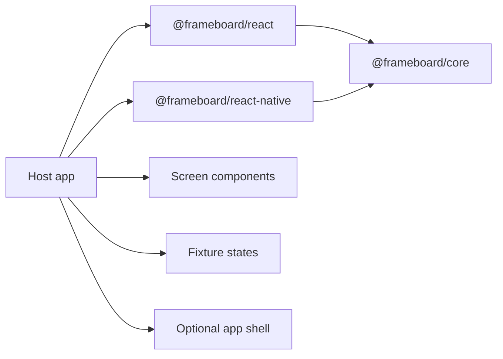

# Architecture

FrameBoard is split into framework-agnostic core logic and framework-specific renderers.

## Core

`packages/core` owns:

- screen and state types
- device definitions
- URL/query parameter normalization
- zoom levels
- state caption helpers
- screenshot filename and artboard id helpers

It must not import React, React Native, Expo, routing, analytics, storage, native modules, or host app code.

## React Renderer

`packages/react` owns the DOM canvas UI:

- sidebar
- toolbar
- artboards
- board mode
- focus mode
- PNG export through browser DOM capture

It depends on React, React DOM peers, `@frameboard/core`, `lucide-react`, and `html-to-image`.

## React Native Renderer

`packages/react-native` owns the React Native / Expo renderer:

- React Native board UI
- `ResponsiveDimensionsProvider`
- `useResponsiveDimensions`
- `NativeDeviceFrame`
- optional web PNG export when the host has browser DOM access

It depends on React Native peers, `@frameboard/core`, `lucide-react-native`, and `html-to-image`.

## Host App Boundary

The host app provides:

- screen components
- fixture states
- optional app shell renderer
- optional theme integration
- route or page where FrameBoard is mounted
- native side-effect suppression for gallery-safe rendering

FrameBoard has no awareness of any host app.
